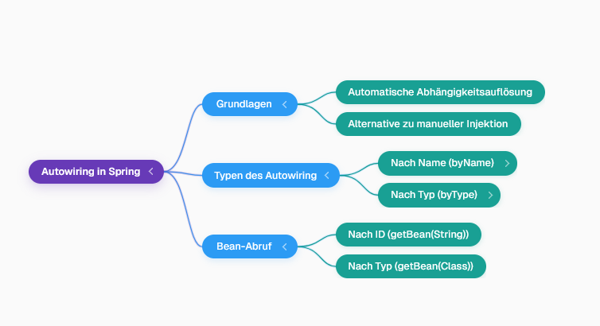

## Autowiring in Spring Framework
- Autowiring ermöglicht die automatische Verbindung von Abhängigkeiten in Spring, was eine Alternative zur manuellen Konstruktor- oder Setter-Injektion darstellt.

## Vorbereitung der Umgebung
- Es wurde eine `Desktop`-Klasse erstellt, die der `Laptop`-Klasse ähnelt und spezifische Nachrichten für die Erstellung und Kompilierung ausgibt.
- Eine `Computer`-Schnittstelle wurde extrahiert, die eine `compile()`-Methode definiert.
- Sowohl die `Laptop`- als auch die `Desktop`-Klasse implementieren nun die `Computer`-Schnittstelle.
- Die `Developer`-Klasse wurde geändert, um von der `Computer`-Schnittstelle abhängig zu sein, anstatt direkt von der `Laptop`-Klasse.
- Der `Developer` verwendet nun `comp.compile()` und der parametrisierte Konstruktor wurde entfernt, um die Abhängigkeit von der Schnittstelle zu betonen.
- Nach diesen Änderungen trat ein Fehler auf, da der Konstruktor in der `spring.xml`-Datei nicht mehr aufgelöst werden konnte.
- Die `Developer`-Klasse wurde vereinfacht, um sich nur auf die `comp`-Eigenschaft (vom Typ `Computer`) zu konzentrieren.

## Manuelle Abhängigkeitsinjektion (Wiederholung)
- Um eine `Computer`-Implementierung in den `Developer` zu injizieren, wird das `<property>`-Tag mit dem Attribut `ref` verwendet, das auf die ID einer Bean verweist.
- Beispielsweise kann eine `Laptop`-Bean (`lab_one`) in die `comp`-Eigenschaft des `Developer` injiziert werden.
- Es ist auch möglich, eine `Desktop`-Bean (`desk_one`) zu definieren und diese stattdessen zu injizieren, indem der `ref`-Wert in der XML-Konfiguration geändert wird.

## Autowiring-Mechanismen
Hier ist eine Mindmap, die die Konzepte des Autowiring in Spring darstellt:

### Autowiring nach Name (`autowire="byName"`)
- Durch Hinzufügen des Attributs `autowire="byName"` zum `<bean>`-Tag des `Developer` sucht Spring automatisch nach einer Bean, deren ID mit dem Namen der Eigenschaft (z.B. `comp`) übereinstimmt.
- Wenn eine Bean mit dem passenden Namen gefunden wird, injiziert Spring diese automatisch.
- > **⚠️ Warnung:** Bei `autowire="byName"` können keine zwei Beans dieselbe ID haben, da dies zu Verwirrung führt und nicht erlaubt ist.

### Autowiring nach Typ (`autowire="byType"`)
- Mit `autowire="byType"` sucht Spring nach einer Bean, deren Typ mit dem Typ der Eigenschaft übereinstimmt (z.B. `Computer`).
- Wenn mehrere Beans desselben Typs im Container vorhanden sind, kann Spring nicht entscheiden, welche injiziert werden soll, was zu einem Fehler führt.
- Um diese Mehrdeutigkeit zu lösen, kann das Attribut `primary="true"` zu einer der Beans hinzugefügt werden, um sie als bevorzugte Wahl zu kennzeichnen.

Hier ist eine Tabelle, die die Unterschiede zwischen `autowire="byName"` und `autowire="byType"` zusammenfasst:

| Merkmal           | `autowire="byName"`                               | `autowire="byType"`                                   |
|:---------------- |:------------------------------------------------ |:---------------------------------------------------- |
| **Mechanismus**   | Sucht Bean mit ID, die dem Property-Namen entspricht. | Sucht Bean, dessen Typ dem Property-Typ entspricht.   |
| **Vorteil**       | Klar, wenn Bean-ID und Property-Name übereinstimmen. | Weniger Konfiguration, wenn Typ eindeutig ist.        |
| **Einschränkung** | Bean-IDs müssen eindeutig sein.                   | Mehrdeutigkeit bei mehreren Beans desselben Typs.     |
| **Lösung**        | N/A                                               | `primary="true"` Attribut für bevorzugte Bean.        |

## Bean-Abruf nach Typ
- Beans können auch direkt nach ihrem Typ abgerufen werden, anstatt nach ihrer ID, indem `context.getBean(Class)` verwendet wird.
- Dies vereinfacht den Code, da kein Casting erforderlich ist.