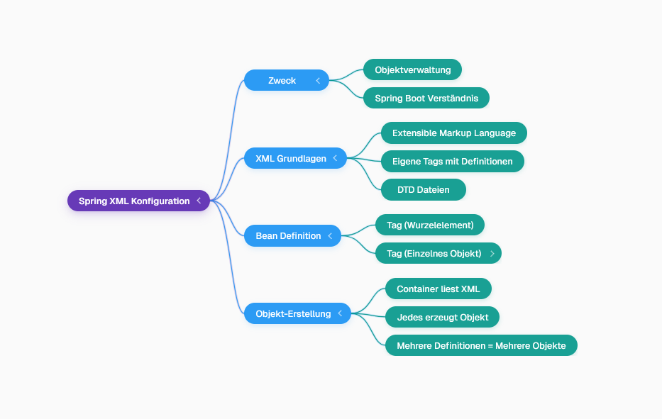
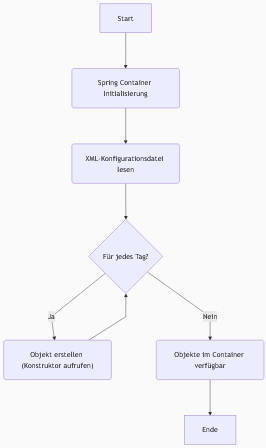

## Grundlagen der Spring XML-Konfiguration
- Die **Spring XML-Konfiguration** ermöglicht das Verständnis der internen Abläufe von Spring Boot und die Verwaltung von Objekten durch den Spring-Container.
- Im Gegensatz zu HTML, wo Tags vordefiniert sind, erlaubt XML die Verwendung eigener Tags, sofern deren Definitionen (z.B. in **DTD-Dateien**) vorhanden sind.
- Für das Spring Framework müssen spezifische Tags wie `<beans>` und `<bean>` verwendet werden, die vordefinierte Bedeutungen haben.

Hier ist eine Mindmap, die die Struktur der Spring XML-Konfiguration darstellt:

## Definieren von Beans
- Um Spring mitzuteilen, welche Objekte es verwalten soll, wird der `<beans>`-Tag als Wurzel verwendet.
- Innerhalb des `<beans>`-Tags wird für jedes zu verwaltende Objekt ein `<bean>`-Tag definiert.
- Das `class`-Attribut des `<bean>`-Tags muss den **vollqualifizierten Klassennamen** (z.B. `com.theis.dev`) angeben.
- Optional kann ein `id`-Attribut (z.B. `id="dev"`) für den Bean vergeben werden, das dann anstelle des Klassennamens beim Abrufen des Beans verwendet werden kann (z.B. `context.getBean("dev")`).
- Bei Fehlern wie "cannot find Declaration of element beans" fehlt die Definition für den `<beans>`-Tag; diese kann durch Kopieren des Standard-Spring-Bean-Konfigurations-XML-Headers behoben werden.

## Objekt-Erstellung durch den Spring-Container
- Wenn der Spring-Container initialisiert wird (z.B. mittels `new ClassPathXmlApplicationContext("spring.xml")`), liest er die XML-Konfigurationsdatei.
- Für jeden im XML definierten `<bean>`-Tag erstellt der Container automatisch ein Objekt dieser Klasse, indem er den Konstruktor aufruft.
- Selbst wenn die erstellten Objekte nicht direkt im Java-Code verwendet werden, werden sie vom Container instanziiert und verwaltet.
- Wenn ein Bean mehrfach im XML definiert wird (auch mit unterschiedlichen IDs), erstellt Spring für jede Definition ein separates Objekt.

Hier ist ein Flussdiagramm, das den Prozess der Objekt-Erstellung durch den Spring-Container visualisiert:

## Abhängigkeitsinjektion (Ausblick)
- Die nächste Herausforderung besteht darin, wie ein Bean (z.B. `Dev`) ein Objekt eines anderen Beans (z.B. `Laptop`) benötigt, was das Konzept der **Abhängigkeitsinjektion** einführt.